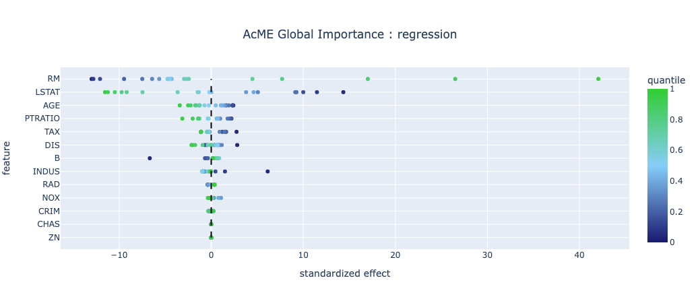
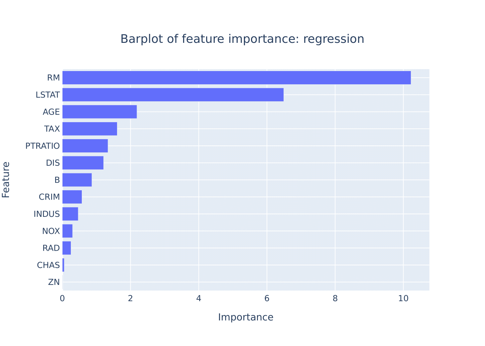
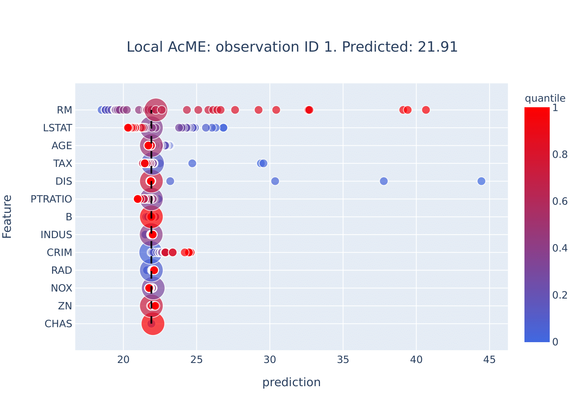
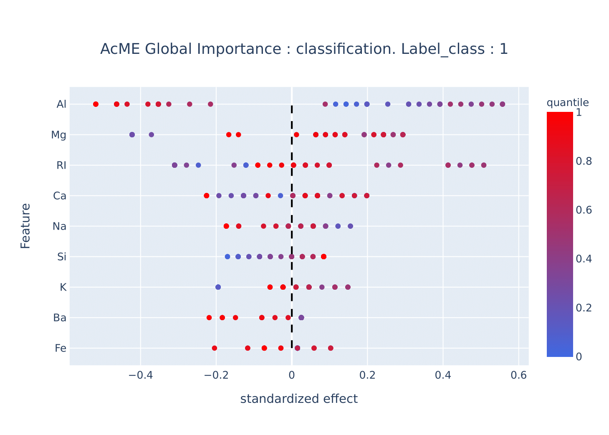

# ACME
ACME - Accelerated Model Explainability 


Model interpretability is nowadays a major field of research in machine learning, due to the increasing complexity of predictive model permitted by the technological improvements. In this paper, we propose \ourmethod a simple procedure that studies the model behaviour observing the changes in the model predictions' caused by using different quantiles of each variable used by the model.  To evaluate the impact of the predictions' changing, we introduce a new measure, named standardize effect, that keeps in count both the changing direction and the overall variable impact amplitude. Standardize effects are also used to compute the final scores that represent the importance of the features. We tested the procedure and we compare the results with the know model interpretability algorithm SHAP. The results of the procedure are very similar, both in term of results that in term of visualization, but considering the speed, \ourmethod outperform SHAP in every situation, proving to be a very usable algorithm, in particular in prediction applications where time efficiency is crucial. Also, the algorithm presents the possibility to study a single observation prediction, giving a local perspective to how the model works, using a "what if" scenario to take real-time decisions.

### INSTALL 
Install with the command:

pip install statwolfACME==1.0.0

## ACME:

### REGRESSION 

The actual implementation works with model objects that have 'predict()' methods (sklearn style model).

``` python
acme_reg = ACME(model, 'target', K=50)
acme_reg = acme_reg.fit(dataset) 
```

``` python
acme_reg.summary_plot()
```



``` python
acme_reg.bar_plot()
```



``` python
acme_reg.feature_importance()
```

#### LOCAL

``` python
acme_local = acme_reg.fit_local(dataset, local=100)
acme_local.summary_plot(local=True)
```



### CLASSIFICATION

The actual implementation works with model objects that have 'predict_proba()' methods.
The classiifcation acme version works as the regression, but requires to specify the class we are looking for explanation.

``` python
model.classes_
array([0, 1])
```

``` python
acme_clas = ACME(model, 'target', K=50, task = 'class', label_class = 1 )
acme_clas = acme_clas.fit(dataset) 
```


