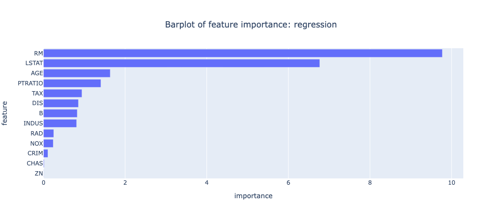
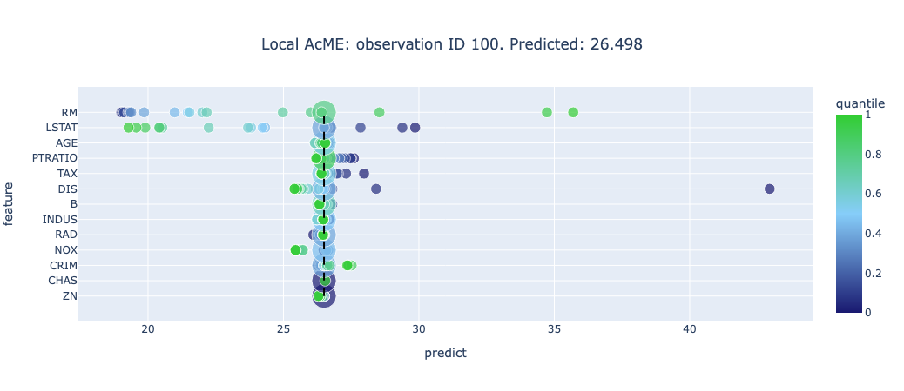

# ACME
ACME - Accelerated Model Explainability 

In this paper (https://www.sciencedirect.com/science/article/abs/pii/S0957417422021339) we propose ACME a simple procedure that studies the model behavior observing the changes in the model predictions' caused by using different quantiles of each variable used by the model.
To evaluate the impact of the predictions' changing, we introduce a new measure, named _standardize effect_, that keeps in count both the changing direction and the overall variable impact amplitude. Standardize effects are also used to compute the final scores that represent the importance of the features. 

We tested the procedure and we compare the results with the know model interpretability algorithm SHAP. The results of the procedure are very similar, both in term of results that in term of visualization, but considering the speed, ACME outperform SHAP in every situation, proving to be a very usable algorithm, in particular in prediction applications where time efficiency is crucial. 

Moreover, the algorithm presents the possibility to study a single observation prediction, giving a local perspective to how the model works, using a "what if" scenario to take real-time decisions.

<b> Info </b>

Actually ACME works with __TABULAR DATA__ and model with task:

- __regression__ :  the input model must have _predict_ function
- __classification__ : the input model must have _predict_proba_ function
- __anomaly detection__ : acme has some optimization to study anomaly detection task, but require to provide a _score_function_ with <i>-1 < score < 1</i> where:
    - -1 : full normal
    - 1 : full anomaly
- __all models__ : if a _score function_ is specified during the initialization


## INSTALL 
Install with the command:

```pip install statwolfACME```

## ACME PACKAGE

<details>
  <summary><b>ACME( model, target, features = [], cat_features = [], K = 50, task = 'regression', score_function = None )</b></summary>
  Initialization

    Params:

    - model: object

        the model object, it must have the *predict* method or the ad-hoc parameter *score_function* is required

    - target : str

        column name with the target features. Typically, it is the predicted features (regression and classification), while using the score function could be a particular column (example: in Anomaly detection, the column with the anomaly score)

    - features :  [str]

        list of string with the columns name for all the model features (given in the same order of the model)

    - cat_features : [str]

        list of string with the columns name for categorical features

    - K : int

        number of quantile used in the AcME procedure
    - task :  str

        str with accepted values {'regression','reg','r','c','class','classification'}. It declares the task of the model. When score_function is not None, the parameters is not necessary

    - score_function : function

        function that has as first input the model and second the input data to realize the prediction. It must return a numeric score

</details>

<br>

<details>
  <summary><b>ACME.explain(dataframe, robust = False, label_class = None)</b></summary>

Fit the acme explainability.

    Params:

    - dataframe: pd.DataFrame

        input dataframe for the model

    - robust : bool

        if True exclude the quantile under 0.05 and over 0.95 to remove possible outliers

    - label_class :

        when task is classification, the label of the predicted class must be specified

</details>

<br>

<details>
    <summary><b>ACME.explain_local(series, label_class = None)</b></summary>

Explain the prediction on the given input observation.

    Params:

    - series : pd.Series
        
        observation on which explain the prediction

    - label_class : int,str

        when task is classification, the label of the predicted class must be specified

</details>

<br>

<details>
    <summary><b>ACME.bar_plot()</b></summary>

Feature importance plot
</details>

<br>

<details>
    <summary><b>ACME.summary_plot(local=False)</b></summary>

Generate the recap plot

    Params: 

    - local : bool

        if True return the local summary plot, else the global
</details>

<br>

<details>
    <summary><b>ACME.feature_importance(local=False, weights = {})</b></summary>

Returns the feature importance calculated by AcME.
In case of Anomaly Detection task, it provides ad hoc explanation for anomaly detection, studied for local interpretability.
The score will show what features can altered the prediction from normal to anomalies and viceversa.

    Params:

    - local : bool  
            if true and task is AD, it return the local AD version of feature importance

    - weights : dict
        Dictionary with the importance for each element. Sum must be 1
        - ratio : float

            importance of local score position  

        - distance : float

            importance of inter-quantile distance necessary to change

        - change : float

            importance of the possibility to change prediction

        - delta : float

            importance of the score delta
</details>

<br>

<details>
    <summary><b>ACME.feature_exploration(feature, local=False, plot=False)</b></summary>

Generate anomaly detection feature exploration table or a plot for local observation that, chosen a specific feature, shows how the prediction can change because of the feature.

    Params:

    - feature : str

        selected feature's name
    
    - plot : bool
    
        if true returns the plot, else returns the table

</details>
<br>

<details>
    <summary><b>ACME.summary_table(local = False)</b></summary>

Expose the global or local summary table with all the info calculated by acme, like standardized effect, quantile with linked original values, etc. for global interpretability

    Params:

    - local : bool
        if return the local or the global table

    - fitted_acme.local_table()

        return table with all the info calculated by acme, like standardized effect, quantile with linked original values, etc. for local interpretability
</details>

<br>

<details>
    <summary><b>ACME.baseline_values(local=False)</b></summary>

Expose the baseline vector used for AcME

    Params:

    - local : bool
        if True expose the local baseline, else the global

</details>

<br>

## 2) EXAMPLES

<br>

<details>
    <summary><b> REGRESSION </b></summary>

```python
acme_reg = ACME(model, 'target', K=50)
acme_reg = acme_reg.fit(dataset) 
```

```python
acme_reg.summary_plot()
```


```python
acme_reg.bar_plot()
```



<b>LOCAL</b>

```python
acme_local = acme_reg.fit_local(dataset, local=100)
acme_local.summary_plot(local=True)
```



</details>

<br>

<details>
    <summary><b> CLASSIFICATION </b></summary>

The classification acme version works as the regression, but requires to specify the class we are looking for explanation.

```python
model.classes_
array([0, 1])
```

```python
acme_class = ACME(model, 'target', K=50, task = 'class', label_class = 1 )
acme_class = acme_class.fit(dataset) 
```


</details>

<br>

<details>
    <summary><b>  SCORE FUNCTION</b></summary>
The model in this case is an isolation forest model

```python

def score_function(model, data):
    try: # for global
        df = model.decision_function(data)
    except: # for local
        df = model.decision_function(data.reshape(1,-1))

    return -1*df

acme_ifo = ACME(ifo, 'AD_score', K=50, task='regression', score_function=score_function, features=features)
acme_ifo = acme_ifo.fit(dataset, robust = True)

```

</details>